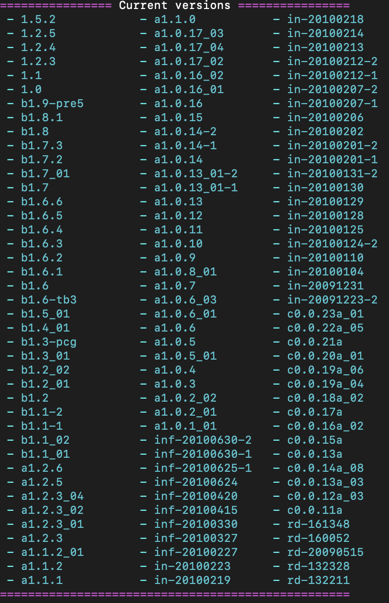

# Getting Started

This page covers how to setup RetroMCP with Eclipse  
What you will need:  
- [RetroMCP](https://github.com/MCPHackers/RetroMCP-Java/releases/tag/v1.0-pre3)  
- [Eclipse](https://eclipseide.org/)  
- [Java Development Kit 8](https://www.oracle.com/java/technologies/javase/javase8-archive-downloads.html)  

Once you have JDK 8 and Eclipse installed and setup, follow these steps to setup your RetroMCP Project:  

## Using the CLI

1. Download the RetroMCP-Java-all jar from the link above  
2. Move it into the directory you want to decompile Minecraft into  
3. Run the jar in the command line with `java -jar RetroMCP-Java-all.jar`  
4. Run the setup task with `setup`  
5. Choose which version you want to use from this list of versions and enter it into RetroMCP (ex. `b1.7.3` for Beta 1.7.3)
  
6. After the version is done downloading, run `decompile`  
7. After the version is done decompiling you are safe to close the command line  
8. Open Eclipse and set the workspace path to the workspace folder in the RetroMCP directory (ex. C:/RetroMCP/workspace)  
9. You can now start modding your chosen version of Minecraft! All the code is found in the `net.minecraft.src` package  

## Using the GUI
1. Download the RetroMCP-Java-all jar from the link above  
2. Move it into the directory you want to decompile Minecraft into  
3. Open the jar with a double click or running `java -jar RetroMCP-Java-all.jar`
4. Choose your Minecraft version from the dropdown on the right
5. When it is done setting up, run decompile
6. After the version is done decompiling you are safe to close the command line  
7. Open Eclipse and set the workspace path to the workspace folder in the RetroMCP directory (ex. C:/RetroMCP/workspace)  
8. You can now start modding your chosen version of Minecraft! All the code is found in the `net.minecraft.src` package  

(NOTE): It is good practice to create your own package to differentiate your code from Minecraft's. You should have it be outside of the `net.minecraft` package and it should follow the [Java Naming Conventions](https://docs.oracle.com/javase/tutorial/java/package/namingpkgs.html) (ex. `xyz.limegradient`)